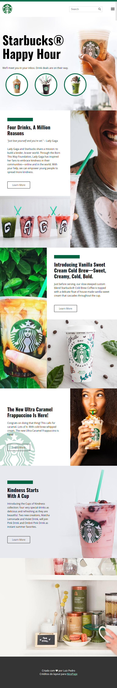
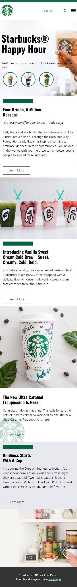
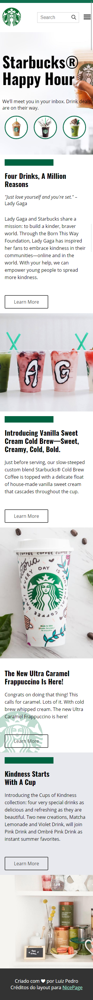

# Starbucks

  

  
  
  
  
	
  

## 💻 Projeto

Starbucks é um projeto simples feito em html e css.
Foi feito durante o curso da [B7web](https://alunos.b7web.com.br/).
Créditos do layout para [NicePage](https://starbucks.nicepage.io/)

## - 🌐 Web

> https://luizpedrosm.github.io/b7-js-urna-eletronica/

## 📷 Imagens

    
    
    

    
    
    

## 🚀 Tecnologias

Esse projeto foi desenvolvido com as seguintes tecnologias:

- [HTML](https://www.w3schools.com/html/default.asp)
- [CSS](https://www.w3schools.com/css/default.asp)
